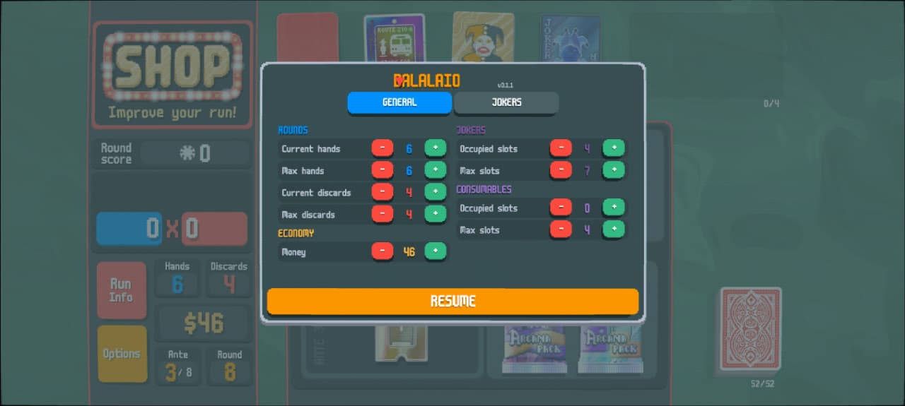
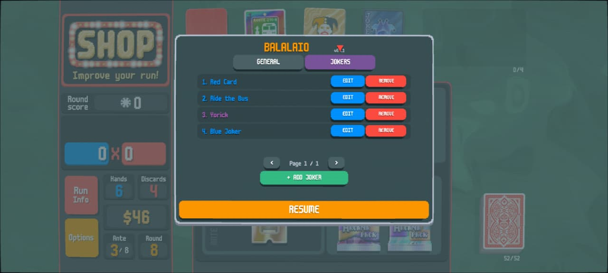
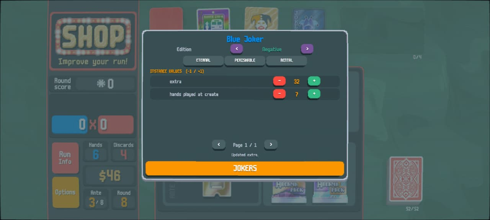
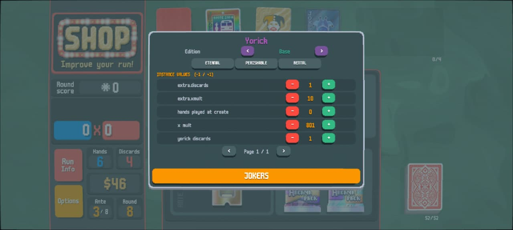

# Balalaio

Balalaio is an offline, in-game control panel for Balatro. It gives you direct
control over run resources and Jokers through a native-looking overlay—without
editing `Balatro.exe` or distributing any game files.

The primary release now targets **Balatro on Steam for Windows** through
[Lovely](https://github.com/ethangreen-dev/lovely-injector) and
[Steamodded](https://github.com/Steamodded/smods). The install-ready mod is in
[`Balalaio/`](Balalaio/).

> Balalaio is intended for offline, single-player experimentation. Back up any
> run you care about before using cheats.

## What it can do

- Change current and maximum hands or discards.
- Change money, Joker capacity, and consumable capacity.
- Add and remove Jokers through a rarity-filtered browser.
- Change Joker editions: Base, Foil, Holographic, Polychrome, and Negative.
- Toggle Eternal, Perishable, and Rental stickers.
- Inspect and adjust numeric values on individual Joker instances.
- Drag the compact `BALALAIO` launcher to a convenient screen position.
- Save mutations through Balatro's normal run-save path.

## In-game examples

| General run controls | Joker management |
| --- | --- |
|  |  |

| Editing a Negative Blue Joker | Editing Yorick's instance values |
| --- | --- |
|  |  |

## One-click Windows installation

Requirements:

- Balatro installed through Steam on Windows.
- An internet connection for the first installation.
- Balatro completely closed while the installer runs.

Download and extract this repository, then double-click:

```text
install.bat
```

The installer:

1. Detects Balatro from Steam's registry entries, default folder, and additional
   Steam libraries.
2. Opens a folder picker if it cannot find the game automatically.
3. Downloads the latest published Windows release of Lovely.
4. Downloads the latest published Steamodded release.
5. Installs Balalaio to `%APPDATA%\Balatro\Mods\Balalaio`.
6. Moves any replaced loader or mod folders to
   `%APPDATA%\Balatro\Balalaio Backups` first.

It does **not** touch profiles or saves under `%APPDATA%\Balatro\1`.

To run it from PowerShell instead:

```powershell
powershell -NoProfile -ExecutionPolicy Bypass -File .\install.ps1
```

Useful alternatives:

```powershell
# Always choose the folder containing Balatro.exe
.\install.ps1 -ChooseGameFolder

# Supply a non-default Steam library directly
.\install.ps1 -GamePath "D:\SteamLibrary\steamapps\common\Balatro"

# Install only Balalaio when Lovely and Steamodded are already managed separately
.\install.ps1 -SkipDependencies

# Use already-downloaded official release archives
.\install.ps1 -LovelyArchivePath .\lovely-windows.zip `
  -SteamoddedArchivePath .\steamodded.zip
```

If Windows denies access to the Steam game folder, right-click `install.bat` and
choose **Run as administrator**.

### First launch

Launch Balatro normally through Steam. Lovely should open a second console
window, and Steamodded should show Balalaio in its Mods menu. Start or continue
a run; the movable `BALALAIO` launcher appears during active gameplay.

Lovely is an open-source runtime injector, so security software can occasionally
flag it heuristically. The installer never disables antivirus or adds
exclusions. See Steamodded's
[official Windows guide](https://github.com/Steamodded/smods/wiki/Installing-Steamodded-windows)
if `version.dll` is quarantined.

## Manual installation

Use the standard layout documented by
[Lovely](https://github.com/ethangreen-dev/lovely-injector#manual-installation)
and Steamodded:

```text
<Steam library>\steamapps\common\Balatro\
  Balatro.exe
  version.dll

%APPDATA%\Balatro\Mods\
  smods\
    lovely\
    src\
    version.lua
    ...
  Balalaio\
    Balalaio.json
    balalaio.lua
```

1. Put Lovely's Windows x64 `version.dll` beside `Balatro.exe`.
2. Extract Steamodded so its loader files are directly inside `Mods\smods`.
3. Copy this repository's complete [`Balalaio/`](Balalaio/) folder into
   `%APPDATA%\Balatro\Mods`.

Avoid copying the whole repository into `Mods`; only the install-ready
`Balalaio` folder belongs there.

## Compatibility

- Platform: Balatro Steam for Windows.
- Tested game version: `1.0.1o-FULL` (revision `1.0.1o`).
- Mod loader: Steamodded `1.0.0` beta line or newer.
- Runtime injector: Lovely `0.9.0` or newer.

`Balalaio.json` deliberately pins the full tested Balatro version because the panel
uses internal game APIs. If Balatro updates, Steamodded will refuse to load
Balalaio instead of risking a broken save or startup crash until compatibility
is verified.

Steamodded currently supports the Steam release of Balatro on Windows; the
Microsoft Store build is not supported.

## Updating and uninstalling

Run `install.bat` again to refresh Lovely, Steamodded, and Balalaio. Existing
copies are backed up outside `Mods` so Steamodded cannot discover duplicate
loaders.

To remove only Balalaio, delete:

```text
%APPDATA%\Balatro\Mods\Balalaio
```

To remove the mod loader entirely, also delete `version.dll` beside
`Balatro.exe` and the `smods` folder. Other Steamodded mods will stop working.

## Development

Requirements:

- Node.js 22 or newer.
- Windows PowerShell 5.1 or PowerShell 7+.

Run the full local suite:

```powershell
npm ci
npm test
```

The suite checks Lua 5.1 parsing, Steamodded metadata, reload safety, mocked run
mutations, the real Balatro input path when user-owned extracted assets are
available, a sandboxed installer fixture, and the legacy APK injection path.

The source-only Android builder remains available for the previously verified
mobile wrapper:

```powershell
.\scripts\build.ps1 -InputApk .\Balatro-v1.8.apk
```

It accepts only a compatible, legally obtained APK and writes
`dist\Balalaio.apk`. It does not remove or bypass license, integrity, or
anti-tamper systems. APKs, signing material, game assets, generated packages,
and local extraction directories remain excluded from Git.

## Project boundaries

This repository contains original Balalaio source, installer/build scripts,
tests, and user-provided screenshots. It does not contain Balatro, extracted
game assets, Lovely or Steamodded binaries, signing keys, or APK files. Balatro
and its assets belong to their respective rights holders.

Balalaio is released under the [MIT License](LICENSE).
